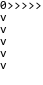

# StringRecorder
create GIF animation from sequence of `str`s.

## Requirements
- ImageMagick

## Usage

Run this:
```python
import string_recorder
import random
rec = string_recorder.StrRecorder()
for i in range(10):
    x = random.randint(0, 5)
    rec.record_frame('{}{}\n{}'.format(i, '>' *x, 'v\n' * x))
rec.make_gif('test.gif')
```

And you will obtain this:  

