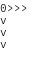

# StringRecorder

StringRecorder is a Python package for programatically creating animated GIFs
from string objects in Python scripts.  The package provides the APIs for
recording the string data and writing the recorded data to an animated GIF
file.

## Requirements
- numpy
- pillow
- imageio


## Usage

First, you need to import the module `string_recorder`.

```python
>>> import string_recoder
```

The module defines the class, `StringRecorder`. The class provides the methods
for recording and creating animated GIF files.

Here is an example of how to record and create an animated GIF (the code
is avaiable at `examples/example.py`):

```python
import random
import string_recorder


rec = string_recorder.StringRecorder()
for i in range(10):
    x = random.randint(0, 5)
    rec.record_frame('{}{}\n{}'.format(i, '>' * x, 'v\n' * x))
rec.make_gif('test.gif')
```

In the example, the data is recorded using the `record_frame` method
and an animated GIF file is created using the `make_gif` method.

Running the script will produce the following GIF:




### Connecting with OpenAI Gym.

You can also use `string_recorder` for the record of OpenAI gym.  
Note that the record must be done with `ansi` mode, i.e., 
only text-based environment is allowed.

```python
import subprocess

import gym
from gym.monitoring import VideoRecorder

import string_recorder


env = gym.make('Taxi-v2')
rec = string_recorder.StringRecorder()  # <---

# timestep_limit = env.spec.tags.get(
#        'wrapper_config.TimeLimit.max_episode_steps')
timestep_limit = 15

# typical gym loop
for e in range(3):
    out_path = 'records/episode{}.json'.format(e)
    video = VideoRecorder(env, out_path)
    obs = env.reset()

    for t in range(timestep_limit):
        env.render()
        subprocess.call('clear', shell=False)

        action = env.action_space.sample()
        obs, reward, done, info = env.step(action)
        video.capture_frame()

    video.close()  # record with json format is dumped
    rec.make_gif_from_gym_record(out_path)  # <---
```

By running the above code (`examples/example_gym.py`),
you will obtain three GIFs in `records` directory
(episode0.gif, episode1.gif, and episode2.gif) .  


You can directly use `string_recorder` without
`gym.monitering.VideoRecorder` as well (like the first example):
```python
rec = string_recorder.StringRecorder()
# loop
for t in range(timestep_limit):
  frame = env.render(mode='ansi')
  print(frame)
  rec.record_frame(frame)

rec.make_gif('gym_without_videorecoder.gif')
```

### Ascii Art

AAアニメも作れるよ！(`examples/example_aa.py`)


